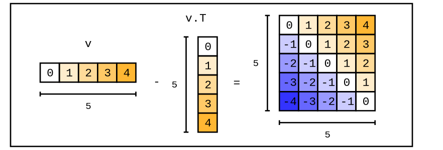
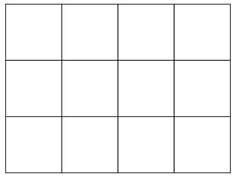
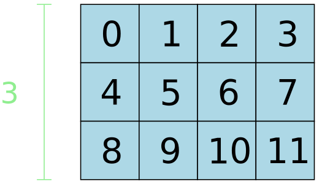
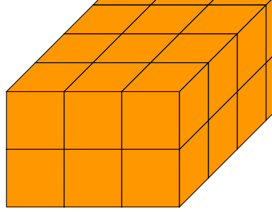
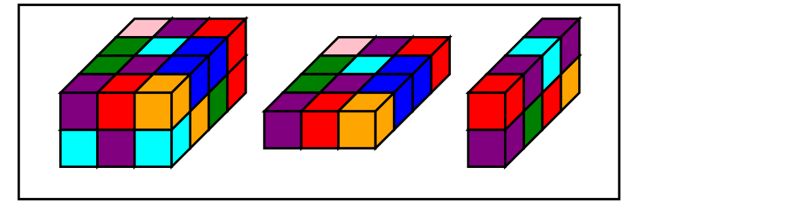

# tensordiagram



A python library for visualizing tensors from torch, jax, tensorflow, numpy, etc. Helps with learning and debugging in notebokos and other contexts. It's built on top of the graphics backend, [chalk](https://chalk-diagrams.github.io).

## install

```bash
pip install tensordiagram
```

Separately, you'll need to install cairo for png images:

```bash
# might need to install the base library first on debian
sudo apt-get install libcairo2-dev

# cairo python bindings
pip install ".[cairo]"
```

Or, for svg images:

```bash
pip install ".[svg]"
```

## intro

For an in-depth guide, refer to this [notebook](https://colab.research.google.com/drive/1GnoRwsFeaPBAYXawVrnQjf_aooR9OUq2?usp=sharing).

```python
import numpy as np
import tensordiagram as td

tensor = np.arange(12).reshape(3, 4)
diagram = td.to_diagram(tensor)
```



The **diagram can be saved** using `render_png` or `render_svg`:

```python
diagram.render_png("output.png", height=300)
```

**Style and annotate diagrams**:

```python
diagram \
  .fill_values() \
  .fill_color("lightblue") \
  .annotate_dim_size(dim="row", color="lightgreen")
```



**3d tensor**:

```python
papaya = "#ff9700"

tensor = np.arange(24).reshape((2, 3, 4))
diagram = td.to_diagram(tensor).fill_color(papaya)
```



Combine tensor and chalk diagrams for intricate outputs: 

```python
import random
import torch

color_names = [ "red", "blue", "green", "purple", "orange", "pink", "cyan"]

def random_colors_tensor(shape):
  colors_array = np.empty(shape, dtype=object)
  for index, _ in np.ndenumerate(colors_array):
    colors_array[index] = random.choice(color_names)
  return colors_array

color_tensor = random_colors_tensor(shape=(2, 3, 4))

# tensors
t = torch.arange(24).reshape((2, 3, 4))
slice_1 = t[0, :, :].unsqueeze(0)
slice_2 = t[:, 1, :].unsqueeze(1)

# tensor diagrams
t_d = td.to_diagram(t).fill_color(lambda idx, v: color_tensor[idx])
slice_1_d = td.to_diagram(slice_1).fill_color(lambda idx, v: color_tensor[idx])
slice_2_d = td.to_diagram(slice_2).fill_color(lambda idx, v: color_tensor[idx[0], 1, idx[2]])

# chalk diagrams
diagrams = []
for d in [t_d, slice_1_d, slice_2_d]:
  diagrams.append(d.to_chalk_diagram().center_xy())

# composite diagram
composite = chalk.hcat(diagrams, 1.0)

# add background + display
composite = composite.pad(1.5).center_xy()
env = composite.get_envelope()
chalk.set_svg_height(300)
chalk.rectangle(env.width * 0.8, env.height).fill_color(Color("white")) + composite.translate(dx=env.width * 0.1, dy=0)
```




For more examples and documentation, refer to this [guide](https://colab.research.google.com/drive/1GnoRwsFeaPBAYXawVrnQjf_aooR9OUq2?usp=sharing).

## dev

```bash
pip install -e ".[dev]"
```

### test

#### setup

Visual regression tests compare rendered output against reference images stored in `fixtures/`.

To generate or update reference images:

```bash
# all reference images
python tests/generate_references.py --all

# list reference images
python tests/generate_references.py --list

# select reference images
python tests/generate_references.py 3d_tensor styled_gradient
```

#### run

All tests:

```bash
pytest
```

## license

MIT
